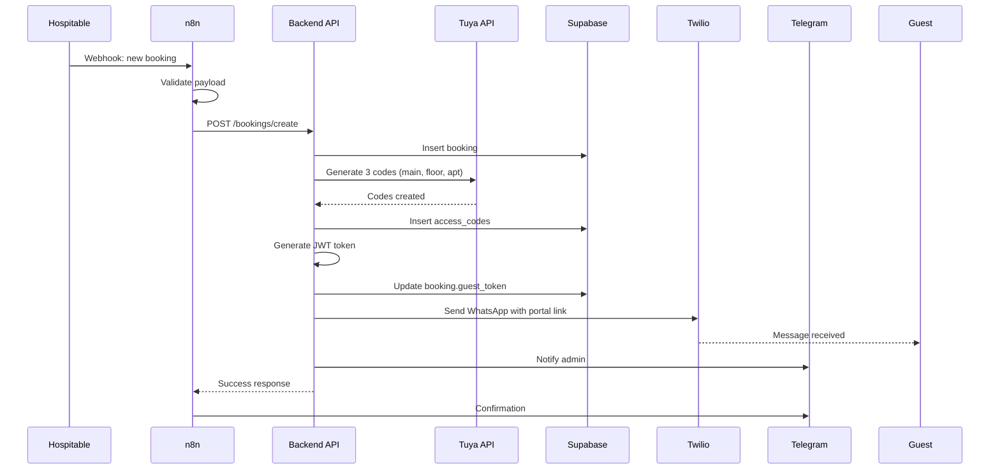
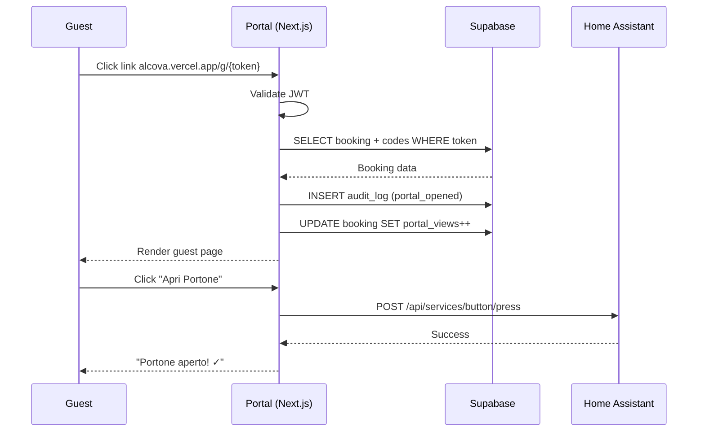
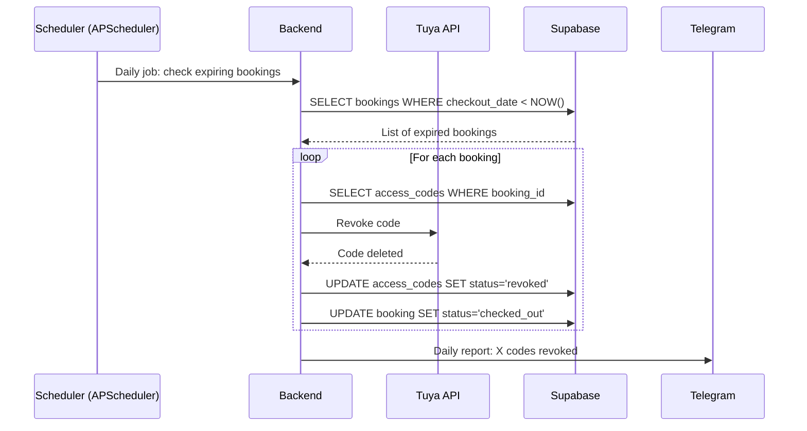
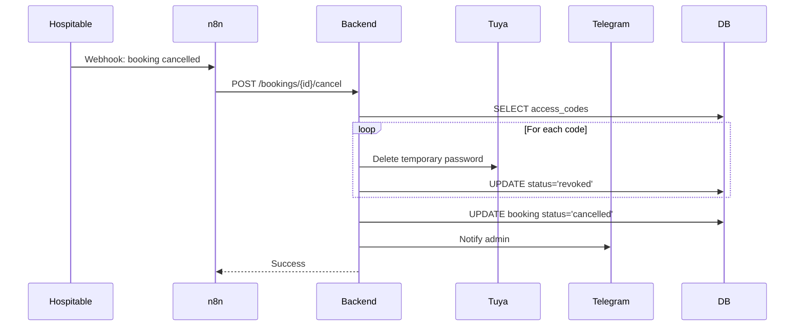

# 🏠 ALCOVA SMART CHECK-IN - MASTERPLAN

> **Progetto:** Automazione completa check-in/check-out per appartamenti Airbnb
> **Owner:** Salvatore Crocella
> **Inizio:** 7 Novembre 2025
> **Target MVP:** 15 Novembre 2025 (1 settimana)

---

## 📋 INDICE

1. [Vision & Obiettivi](#vision--obiettivi)
2. [Architettura Tecnica](#architettura-tecnica)
3. [Tech Stack](#tech-stack)
4. [Struttura Progetto](#struttura-progetto)
5. [Database Schema](#database-schema)
6. [Flussi Operativi](#flussi-operativi)
7. [Roadmap & Timeline](#roadmap--timeline)
8. [Checklist Implementazione](#checklist-implementazione)
9. [Configurazioni & Credenziali](#configurazioni--credenziali)
10. [Testing & Deploy](#testing--deploy)

---

## 🎯 VISION & OBIETTIVI

### Vision
Creare un'esperienza di check-in **completamente automatizzata** e **premium** per gli ospiti Alcova Landolina, eliminando interventi manuali e riducendo errori operativi.

### Obiettivi Primari
- ✅ **Automazione 100%**: dalla prenotazione al check-out senza intervento umano
- ✅ **Sicurezza**: codici temporanei generati automaticamente e revocati alla partenza
- ✅ **Esperienza Premium**: guest portal brandizzato con tutte le info necessarie
- ✅ **Multilingua**: supporto IT/EN per ospiti internazionali
- ✅ **Notifiche Real-time**: admin sempre aggiornato via Telegram

### KPI di Successo
- ⏱️ Tempo risparmio: da 15 min/prenotazione a 0 min
- 📉 Errori codici: da ~5% a 0%
- 📱 Soddisfazione ospite: >4.8/5 su comunicazione
- 🔐 Sicurezza: 0 accessi non autorizzati

---

## 🏗️ ARCHITETTURA TECNICA

### Diagramma Flusso

```
┌─────────────────────────────────────────────────────────────┐
│                    HOSPITABLE (Airbnb)                      │
│                     Webhook Endpoint                        │
└────────────────────┬────────────────────────────────────────┘
                     │
                     │ POST /webhook/booking
                     ▼
┌─────────────────────────────────────────────────────────────┐
│                        n8n WORKFLOW                         │
│  ┌──────────────────────────────────────────────────────┐   │
│  │  1. Ricevi webhook Hospitable                        │   │
│  │  2. Valida payload                                   │   │
│  │  3. Chiama FastAPI /bookings/create                 │   │
│  │  4. Invia notifica Telegram (admin)                 │   │
│  │  5. Schedule checkout automation                    │   │
│  └──────────────────────────────────────────────────────┘   │
└────────────────────┬────────────────────────────────────────┘
                     │
                     ▼
┌─────────────────────────────────────────────────────────────┐
│              BACKEND FASTAPI (Railway.app)                  │
│  ┌──────────────────────────────────────────────────────┐   │
│  │ API ENDPOINTS                                        │   │
│  │ • POST /bookings/create                             │   │
│  │ • POST /bookings/{id}/cancel                        │   │
│  │ • GET  /guests/{token}                              │   │
│  │ • POST /intercom/open                               │   │
│  │ • POST /codes/revoke                                │   │
│  └──────────────────────────────────────────────────────┘   │
│  ┌──────────────────────────────────────────────────────┐   │
│  │ SERVICES                                             │   │
│  │ • TuyaService: gestione 3 serrature                 │   │
│  │ • CodeGenerator: PIN temporanei 6 cifre            │   │
│  │ • NotificationService: WhatsApp/SMS/Email           │   │
│  │ • TokenService: JWT per guest portal                │   │
│  │ • SchedulerService: auto-revoke codes               │   │
│  │ • HomeAssistantService: Ring Intercom               │   │
│  └──────────────────────────────────────────────────────┘   │
└───┬────────┬────────┬────────┬────────┬──────────┬──────────┘
    │        │        │        │        │          │
    ▼        ▼        ▼        ▼        ▼          ▼
┌────────┐ ┌────┐ ┌──────┐ ┌──────┐ ┌────────┐ ┌──────┐
│Supabase│ │Tuya│ │Twilio│ │Home  │ │Telegram│ │SMTP  │
│   DB   │ │API │ │  API │ │Assist│ │  Bot   │ │Email │
└────────┘ └────┘ └──────┘ └──────┘ └────────┘ └──────┘
    ▲
    │ Read guest data
    │
┌───┴────────────────────────────────────────────────────────┐
│           GUEST PORTAL (Next.js - Vercel)                  │
│  URL: alcova-landolina.vercel.app/g/{token}               │
│  ┌─────────────────────────────────────────────────────┐   │
│  │ • Codici accesso (3 porte)                          │   │
│  │ • Validità temporale (check-in → check-out)        │   │
│  │ • Indirizzo + Mappa Google Maps                    │   │
│  │ • WiFi + QR Code                                    │   │
│  │ • Pulsante Ring Intercom (apri portone)            │   │
│  │ • Regole casa, raccolta differenziata              │   │
│  │ • Contatti host + supporto                         │   │
│  │ • Multilingua IT/EN                                 │   │
│  └─────────────────────────────────────────────────────┘   │
└────────────────────────────────────────────────────────────┘
```

### Componenti Chiave

| Componente | Tecnologia | Responsabilità | Hosting |
|------------|------------|----------------|---------|
| **Orchestrator** | n8n | Workflow automation, webhook handling | Self-hosted/Cloud |
| **Backend API** | FastAPI (Python 3.11+) | Business logic, integrazioni | Railway.app |
| **Database** | Supabase (PostgreSQL) | Persistenza dati | Supabase Cloud |
| **Frontend** | Next.js 14 (App Router) | Guest portal | Vercel |
| **Smart Locks** | Tuya Cloud API | Gestione 3 serrature | Cloud |
| **Messaging** | Twilio (WhatsApp Business) | Notifiche ospiti | Cloud |
| **Intercom** | Home Assistant + Ring | Apertura portone | Self-hosted |
| **Admin Alerts** | Telegram Bot | Notifiche admin | Cloud |

---

## 🛠️ TECH STACK

### Backend
```python
# Core Framework
fastapi==0.104.1
uvicorn[standard]==0.24.0
pydantic==2.5.0
pydantic-settings==2.1.0

# Database
supabase==2.0.3
asyncpg==0.29.0

# Integrations
tinytuya==1.13.2          # Tuya local control (fallback)
tuya-connector==0.1.0     # Tuya Cloud API
twilio==8.10.0            # WhatsApp/SMS
python-telegram-bot==20.7
aiohttp==3.9.1
httpx==0.25.1

# Utilities
python-jose[cryptography]==3.3.0  # JWT
passlib[bcrypt]==1.7.4
python-multipart==0.0.6
apscheduler==3.10.4       # Scheduler
python-dotenv==1.0.0

# Development
pytest==7.4.3
pytest-asyncio==0.21.1
black==23.11.0
ruff==0.1.6
```

### Frontend
```json
{
  "dependencies": {
    "next": "14.0.3",
    "react": "18.2.0",
    "react-dom": "18.2.0",
    "@supabase/supabase-js": "^2.38.4",
    "jose": "^5.1.0",
    "tailwindcss": "^3.3.5",
    "next-intl": "^3.3.0",
    "lucide-react": "^0.292.0",
    "qrcode.react": "^3.1.0",
    "date-fns": "^2.30.0"
  },
  "devDependencies": {
    "typescript": "^5.3.2",
    "@types/node": "^20.9.2",
    "@types/react": "^18.2.38",
    "autoprefixer": "^10.4.16",
    "postcss": "^8.4.31"
  }
}
```

---

## 📁 STRUTTURA PROGETTO

```
alcova-smart-checkin/
│
├── 📄 MASTERPLAN.md              # Questo documento
├── 📄 README.md                  # Setup instructions
├── 📄 .env.example               # Template variabili ambiente
├── 📄 .gitignore
├── 📄 docker-compose.yml         # Local development
│
├── 📁 backend/                   # FastAPI Application
│   ├── 📄 main.py               # Entry point
│   ├── 📄 requirements.txt
│   ├── 📄 Dockerfile
│   ├── 📄 .env
│   │
│   └── 📁 app/
│       ├── 📄 __init__.py
│       │
│       ├── 📁 api/              # API Endpoints
│       │   ├── 📄 __init__.py
│       │   ├── 📄 bookings.py   # POST /bookings/create, /cancel
│       │   ├── 📄 guests.py     # GET /guests/{token}
│       │   ├── 📄 codes.py      # POST /codes/revoke
│       │   ├── 📄 intercom.py   # POST /intercom/open
│       │   └── 📄 webhooks.py   # POST /webhooks/hospitable
│       │
│       ├── 📁 services/         # Business Logic
│       │   ├── 📄 __init__.py
│       │   ├── 📄 tuya_service.py          # Tuya lock management
│       │   ├── 📄 code_generator.py        # PIN generation
│       │   ├── 📄 notification_service.py  # WhatsApp/SMS/Email
│       │   ├── 📄 token_service.py         # JWT tokens
│       │   ├── 📄 scheduler.py             # APScheduler jobs
│       │   └── 📄 home_assistant.py        # Ring Intercom
│       │
│       ├── 📁 models/           # Pydantic Models
│       │   ├── 📄 __init__.py
│       │   ├── 📄 booking.py
│       │   ├── 📄 guest.py
│       │   ├── 📄 lock.py
│       │   └── 📄 notification.py
│       │
│       ├── 📁 core/             # Configuration
│       │   ├── 📄 __init__.py
│       │   ├── 📄 config.py     # Settings from .env
│       │   ├── 📄 security.py   # JWT, encryption
│       │   └── 📄 database.py   # Supabase client
│       │
│       └── 📁 utils/
│           ├── 📄 __init__.py
│           ├── 📄 logger.py
│           └── 📄 exceptions.py
│
├── 📁 frontend/                 # Next.js Guest Portal
│   ├── 📄 package.json
│   ├── 📄 next.config.js
│   ├── 📄 tailwind.config.ts
│   ├── 📄 tsconfig.json
│   │
│   ├── 📁 app/
│   │   ├── 📄 layout.tsx
│   │   ├── 📄 page.tsx          # Landing page (redirect)
│   │   │
│   │   ├── 📁 g/                # Guest portal
│   │   │   └── 📁 [token]/
│   │   │       ├── 📄 page.tsx  # Main guest view
│   │   │       └── 📄 layout.tsx
│   │   │
│   │   └── 📁 api/
│   │       └── 📁 intercom/
│   │           └── 📄 route.ts  # Proxy to Ring via HA
│   │
│   ├── 📁 components/
│   │   ├── 📄 GuestHeader.tsx
│   │   ├── 📄 AccessCodes.tsx   # Codici 3 porte
│   │   ├── 📄 PropertyInfo.tsx  # Mappa, WiFi
│   │   ├── 📄 IntercomButton.tsx # Ring doorbell
│   │   ├── 📄 HouseRules.tsx
│   │   ├── 📄 LanguageSwitcher.tsx
│   │   └── 📄 LoadingSpinner.tsx
│   │
│   ├── 📁 lib/
│   │   ├── 📄 supabase.ts       # Supabase client
│   │   ├── 📄 jwt.ts            # Token validation
│   │   └── 📄 i18n.ts           # Internationalization
│   │
│   ├── 📁 messages/             # i18n translations
│   │   ├── 📄 it.json
│   │   └── 📄 en.json
│   │
│   └── 📁 public/
│       ├── 📄 logo-alcova.svg
│       └── 📁 icons/
│
├── 📁 database/
│   ├── 📄 schema.sql            # Supabase schema
│   ├── 📄 seed.sql              # Test data
│   └── 📄 migrations/
│
├── 📁 docs/
│   ├── 📄 API.md                # API documentation
│   ├── 📄 SETUP.md              # Setup instructions
│   ├── 📄 ARCHITECTURE.md       # Technical details
│   ├── 📄 DEPLOYMENT.md         # Deploy guide
│   └── 📄 TESTING.md            # Test scenarios
│
└── 📁 n8n/
    ├── 📄 workflow-booking.json     # n8n workflow export
    └── 📄 workflow-checkout.json
```

---

## 🗄️ DATABASE SCHEMA

### Tabelle Principali

#### **bookings**
Prenotazioni da Hospitable/Airbnb

```sql
CREATE TABLE bookings (
    id UUID PRIMARY KEY DEFAULT gen_random_uuid(),

    -- Hospitable data
    hospitable_id VARCHAR(100) UNIQUE NOT NULL,
    confirmation_code VARCHAR(50),

    -- Guest info
    guest_name VARCHAR(255) NOT NULL,
    guest_email VARCHAR(255) NOT NULL,
    guest_phone VARCHAR(50),
    guest_language VARCHAR(2) DEFAULT 'en', -- 'it' or 'en'

    -- Booking details
    property_id VARCHAR(50) NOT NULL,
    checkin_date TIMESTAMP WITH TIME ZONE NOT NULL,
    checkout_date TIMESTAMP WITH TIME ZONE NOT NULL,
    num_guests INTEGER DEFAULT 1,

    -- Status
    status VARCHAR(50) DEFAULT 'confirmed', -- confirmed, checked_in, checked_out, cancelled

    -- Portal
    guest_token VARCHAR(500), -- JWT token
    portal_opened_at TIMESTAMP WITH TIME ZONE,
    portal_views INTEGER DEFAULT 0,

    -- Metadata
    created_at TIMESTAMP WITH TIME ZONE DEFAULT NOW(),
    updated_at TIMESTAMP WITH TIME ZONE DEFAULT NOW(),

    -- Indexes
    INDEX idx_hospitable_id (hospitable_id),
    INDEX idx_checkin_date (checkin_date),
    INDEX idx_status (status)
);
```

#### **access_codes**
Codici generati per le serrature

```sql
CREATE TABLE access_codes (
    id UUID PRIMARY KEY DEFAULT gen_random_uuid(),

    -- Relations
    booking_id UUID REFERENCES bookings(id) ON DELETE CASCADE,
    lock_id VARCHAR(100) NOT NULL, -- Tuya device ID

    -- Code details
    code VARCHAR(10) NOT NULL, -- 6-digit PIN
    lock_name VARCHAR(100) NOT NULL, -- 'main_entrance', 'floor_door', 'apartment_door'

    -- Validity
    valid_from TIMESTAMP WITH TIME ZONE NOT NULL,
    valid_until TIMESTAMP WITH TIME ZONE NOT NULL,

    -- Status
    status VARCHAR(50) DEFAULT 'active', -- active, revoked, expired
    revoked_at TIMESTAMP WITH TIME ZONE,

    -- Tuya sync
    tuya_sync_status VARCHAR(50), -- pending, synced, failed
    tuya_password_id VARCHAR(100), -- Tuya's internal ID

    -- Metadata
    created_at TIMESTAMP WITH TIME ZONE DEFAULT NOW(),
    updated_at TIMESTAMP WITH TIME ZONE DEFAULT NOW(),

    -- Indexes
    INDEX idx_booking_id (booking_id),
    INDEX idx_status (status),
    INDEX idx_validity (valid_from, valid_until)
);
```

#### **locks**
Configurazione serrature Tuya

```sql
CREATE TABLE locks (
    id UUID PRIMARY KEY DEFAULT gen_random_uuid(),

    -- Tuya details
    device_id VARCHAR(100) UNIQUE NOT NULL,
    device_name VARCHAR(100) NOT NULL,
    lock_type VARCHAR(50) NOT NULL, -- 'main_entrance', 'floor_door', 'apartment_door'

    -- Location
    property_id VARCHAR(50) NOT NULL,
    location_description TEXT,
    display_order INTEGER DEFAULT 0,

    -- Status
    is_active BOOLEAN DEFAULT true,
    last_sync_at TIMESTAMP WITH TIME ZONE,

    -- Metadata
    created_at TIMESTAMP WITH TIME ZONE DEFAULT NOW(),
    updated_at TIMESTAMP WITH TIME ZONE DEFAULT NOW()
);
```

#### **notifications**
Log notifiche inviate

```sql
CREATE TABLE notifications (
    id UUID PRIMARY KEY DEFAULT gen_random_uuid(),

    -- Relations
    booking_id UUID REFERENCES bookings(id) ON DELETE SET NULL,

    -- Notification details
    type VARCHAR(50) NOT NULL, -- 'whatsapp', 'sms', 'email', 'telegram'
    recipient VARCHAR(255) NOT NULL,
    subject VARCHAR(255),
    message TEXT NOT NULL,

    -- Status
    status VARCHAR(50) DEFAULT 'pending', -- pending, sent, failed, delivered
    sent_at TIMESTAMP WITH TIME ZONE,
    delivered_at TIMESTAMP WITH TIME ZONE,
    error_message TEXT,

    -- Provider
    provider VARCHAR(50), -- 'twilio', 'smtp', 'telegram'
    provider_message_id VARCHAR(255),

    -- Metadata
    created_at TIMESTAMP WITH TIME ZONE DEFAULT NOW()
);
```

#### **audit_logs**
Log attività sistema

```sql
CREATE TABLE audit_logs (
    id UUID PRIMARY KEY DEFAULT gen_random_uuid(),

    -- Event details
    event_type VARCHAR(100) NOT NULL, -- 'booking_created', 'code_generated', 'code_revoked', 'portal_opened', etc.
    entity_type VARCHAR(50), -- 'booking', 'code', 'notification'
    entity_id UUID,

    -- Context
    user_agent TEXT,
    ip_address INET,
    metadata JSONB,

    -- Timestamp
    created_at TIMESTAMP WITH TIME ZONE DEFAULT NOW(),

    -- Indexes
    INDEX idx_event_type (event_type),
    INDEX idx_created_at (created_at)
);
```

---

## 🔄 FLUSSI OPERATIVI

### 1️⃣ **FLUSSO NUOVA PRENOTAZIONE**



**Step dettagliati:**

1. **Hospitable invia webhook** a n8n quando conferma prenotazione
2. **n8n valida** il payload e estrae dati essenziali
3. **n8n chiama Backend** `POST /bookings/create` con:
   ```json
   {
     "hospitable_id": "HB123456",
     "guest_name": "Mario Rossi",
     "guest_email": "mario@example.com",
     "guest_phone": "+393331234567",
     "guest_language": "it",
     "checkin_date": "2025-11-15T15:00:00Z",
     "checkout_date": "2025-11-17T11:00:00Z",
     "property_id": "alcova_landolina_fi"
   }
   ```

4. **Backend crea booking** in DB
5. **Backend genera 3 codici PIN** (6 cifre casuali)
6. **Backend chiama Tuya API** per ogni serratura:
   - Main entrance (portone edificio)
   - Floor door (porta pianerottolo)
   - Apartment door (porta appartamento)
   - Validità: da checkin-2h fino a checkout+2h

7. **Backend salva codici** in `access_codes` table
8. **Backend genera JWT token** (scadenza: checkout + 48h)
9. **Backend invia messaggio WhatsApp** via Twilio:
   ```
   🏠 Benvenuto in Alcova Landolina!

   Ciao Mario, siamo felici di accoglierti!

   📅 Check-in: 15 Nov, ore 15:00
   📅 Check-out: 17 Nov, ore 11:00

   🔑 I tuoi codici d'accesso:
   Portone: 123456
   Piano: 789012
   Appartamento: 345678

   📱 Tutte le info qui:
   https://alcova.vercel.app/g/eyJhbG...

   Il link scadrà il 19 Nov.

   A presto! ✨
   ```

10. **Backend notifica admin** su Telegram:
    ```
    ✅ Nuova prenotazione

    👤 Mario Rossi
    📅 15-17 Nov (2 notti)
    🔑 Codici generati
    📨 WhatsApp inviato
    ```

### 2️⃣ **FLUSSO APERTURA GUEST PORTAL**



### 3️⃣ **FLUSSO CHECK-OUT AUTOMATICO**



### 4️⃣ **FLUSSO CANCELLAZIONE PRENOTAZIONE**



---

## 📅 ROADMAP & TIMELINE

### **SETTIMANA 1: MVP (7-15 Novembre)**

#### **Day 1-2: Setup & Database**
- [x] Setup repository structure
- [ ] Create Supabase project
- [ ] Run database migrations
- [ ] Configure .env variables
- [ ] Setup Railway.app project
- [ ] Setup Vercel project

#### **Day 3-4: Backend Core**
- [ ] Implement FastAPI basic structure
- [ ] Tuya Service (test connection, generate codes)
- [ ] Code Generator service
- [ ] Booking API endpoints
- [ ] JWT token service
- [ ] Test code generation end-to-end

#### **Day 5-6: Integrations**
- [ ] n8n workflow: Hospitable → Backend
- [ ] Twilio WhatsApp integration
- [ ] Notification service (SMS fallback)
- [ ] Telegram bot setup
- [ ] Scheduler for auto-revoke
- [ ] Test complete flow with fake booking

#### **Day 7: Guest Portal**
- [ ] Next.js setup + Tailwind
- [ ] Guest page `/g/[token]`
- [ ] Display codes + validity
- [ ] Property info component
- [ ] i18n IT/EN
- [ ] Responsive design

### **SETTIMANA 2: Refinement (16-22 Novembre)**

#### **Day 8-9: Ring Intercom Integration**
- [ ] Home Assistant webhook setup
- [ ] Ring Intercom API research
- [ ] Backend endpoint `/intercom/open`
- [ ] Frontend button component
- [ ] Test apertura portone

#### **Day 10: Branding & UX**
- [ ] Logo Alcova integration
- [ ] Color palette (avorio, ottone, blu notte)
- [ ] Typography (DM Serif Display)
- [ ] WiFi QR code generator
- [ ] Google Maps integration

#### **Day 11-12: Testing & Deploy**
- [ ] End-to-end testing (staging)
- [ ] Real booking test
- [ ] Performance optimization
- [ ] Error monitoring setup (Sentry?)
- [ ] Deploy production
- [ ] Documentation finalization

#### **Day 13-14: Buffer & Fixes**
- [ ] Bug fixes
- [ ] Edge cases handling
- [ ] Monitoring & alerts tuning

### **FASE 2: Advanced Features (Future)**

- [ ] Dashboard admin (React + Supabase Auth)
- [ ] Multi-property support (Firenze, Torino)
- [ ] Home Assistant climate control (auto-off post checkout)
- [ ] Google Calendar sync (pulizie)
- [ ] Analytics dashboard
- [ ] Email templates personalizzati
- [ ] Review automation post-checkout

---

## ✅ CHECKLIST IMPLEMENTAZIONE

### **Setup Iniziale**
- [ ] Repository GitHub creato
- [ ] .gitignore configurato (no .env, no secrets)
- [ ] Struttura cartelle creata
- [ ] README.md con setup instructions

### **Database**
- [ ] Progetto Supabase creato
- [ ] Schema SQL eseguito
- [ ] Row Level Security (RLS) configurato
- [ ] Seed data per testing caricato

### **Backend**
- [ ] FastAPI running locally
- [ ] Environment variables loaded
- [ ] Supabase connection testata
- [ ] Tuya API connection testata
- [ ] Endpoint `/health` funzionante
- [ ] Endpoint `/bookings/create` funzionante
- [ ] Endpoint `/guests/{token}` funzionante
- [ ] Scheduler jobs running
- [ ] Docker container builds successfully

### **n8n**
- [ ] Workflow "New Booking" importato
- [ ] Webhook URL configurato in Hospitable
- [ ] Connessione Backend API testata
- [ ] Telegram notifications funzionanti

### **Frontend**
- [ ] Next.js 14 running locally
- [ ] Tailwind configurato
- [ ] Supabase client setup
- [ ] JWT validation working
- [ ] Page `/g/[token]` rendering
- [ ] i18n IT/EN switching
- [ ] Responsive mobile/desktop

### **Integrazioni**
- [ ] Tuya: codici temporanei creati/revocati
- [ ] Twilio: WhatsApp inviato con successo
- [ ] Twilio: SMS fallback testato
- [ ] Telegram: notifiche admin ricevute
- [ ] Home Assistant: Ring Intercom aperto
- [ ] SMTP: email backup configurato

### **Deploy**
- [ ] Backend deployed su Railway
- [ ] Frontend deployed su Vercel
- [ ] Environment variables production set
- [ ] Domain custom configurato (opzionale)
- [ ] SSL certificates attivi
- [ ] Health checks passing

### **Testing**
- [ ] Prenotazione test end-to-end
- [ ] Codici ricevuti e funzionanti
- [ ] Portal accessibile da mobile
- [ ] Ring Intercom apertura testata
- [ ] Auto-revoke verificato
- [ ] Notifiche Telegram ricevute

---

## 🔐 CONFIGURAZIONI & CREDENZIALI

### **Variabili Ambiente (.env)**

```bash
# ======================
# APPLICATION
# ======================
APP_ENV=production
APP_NAME=Alcova Smart Check-in
APP_URL=https://your-api.railway.app
FRONTEND_URL=https://alcova.vercel.app
SECRET_KEY=your-secret-key-min-32-chars

# ======================
# SUPABASE
# ======================
SUPABASE_URL=https://xxxxx.supabase.co
SUPABASE_ANON_KEY=eyJhbGciOi...
SUPABASE_SERVICE_KEY=eyJhbGciOi...

# ======================
# TUYA
# ======================
TUYA_CLIENT_ID=your_tuya_client_id
TUYA_SECRET=your_tuya_secret
TUYA_REGION=eu  # or us, cn
TUYA_DEVICE_MAIN_ENTRANCE=bf...
TUYA_DEVICE_FLOOR_DOOR=bf...
TUYA_DEVICE_APARTMENT=bf...

# ======================
# TWILIO (WhatsApp/SMS)
# ======================
TWILIO_ACCOUNT_SID=AC...
TWILIO_AUTH_TOKEN=...
TWILIO_WHATSAPP_FROM=whatsapp:+14155238886
TWILIO_SMS_FROM=+1234567890

# ======================
# TELEGRAM
# ======================
TELEGRAM_BOT_TOKEN=123456:ABC-DEF...
TELEGRAM_ADMIN_CHAT_ID=123456789

# ======================
# HOME ASSISTANT
# ======================
HOME_ASSISTANT_URL=http://homeassistant.local:8123
HOME_ASSISTANT_TOKEN=eyJ0eX...
RING_BUTTON_ENTITY_ID=button.ring_intercom_unlock

# ======================
# EMAIL (Fallback)
# ======================
SMTP_HOST=smtp.gmail.com
SMTP_PORT=587
SMTP_USER=your-email@gmail.com
SMTP_PASSWORD=your-app-password
SMTP_FROM=Alcova Landolina <noreply@alcova.com>

# ======================
# n8n
# ======================
N8N_WEBHOOK_URL=https://your-n8n.app/webhook/booking
N8N_WEBHOOK_SECRET=random-secret-string

# ======================
# JWT
# ======================
JWT_SECRET=another-random-secret-min-32-chars
JWT_ALGORITHM=HS256
JWT_EXPIRATION_HOURS=720  # 30 days
```

### **Credenziali da Ottenere**

#### **1. Supabase**
1. Vai a [supabase.com](https://supabase.com)
2. Crea nuovo progetto "alcova-checkin"
3. Copia URL + anon key + service key da Settings > API

#### **2. Tuya Developer**
1. Registrati su [iot.tuya.com](https://iot.tuya.com)
2. Crea Cloud Project
3. Abilita "Smart Home Basic Service"
4. Ottieni Access ID + Access Secret
5. Collega le 3 serrature
6. Annota i Device ID

#### **3. Twilio**
1. Registrati su [twilio.com](https://twilio.com)
2. Acquista numero telefono (+39 o +1)
3. Abilita WhatsApp Business API
4. Copia Account SID + Auth Token

#### **4. Telegram Bot**
1. Apri Telegram, cerca @BotFather
2. `/newbot` → nome: "Alcova Admin"
3. Copia token
4. Avvia chat col bot, invia `/start`
5. Usa [@userinfobot](https://t.me/userinfobot) per trovare il tuo chat_id

#### **5. Home Assistant**
1. Vai a Settings > Users > Long-Lived Access Token
2. Crea token "Alcova API"
3. Trova entity_id del Ring Intercom (Settings > Devices)

---

## 🧪 TESTING & DEPLOY

### **Testing Locale**

```bash
# Backend
cd backend
python -m venv venv
source venv/bin/activate  # Windows: venv\Scripts\activate
pip install -r requirements.txt
cp .env.example .env  # Edit with your credentials
uvicorn app.main:app --reload

# Test endpoint
curl http://localhost:8000/health

# Frontend
cd frontend
npm install
cp .env.example .env.local  # Edit with your credentials
npm run dev

# Visit http://localhost:3000
```

### **Testing Flow Completo**

1. **Simula webhook Hospitable** (usa n8n test mode o cURL):
```bash
curl -X POST http://localhost:8000/bookings/create \
  -H "Content-Type: application/json" \
  -d '{
    "hospitable_id": "TEST123",
    "guest_name": "Mario Rossi",
    "guest_email": "test@example.com",
    "guest_phone": "+393331234567",
    "guest_language": "it",
    "checkin_date": "2025-11-20T15:00:00Z",
    "checkout_date": "2025-11-22T11:00:00Z",
    "property_id": "alcova_landolina_fi"
  }'
```

2. **Verifica database**: controlla booking + codes su Supabase dashboard

3. **Verifica Tuya**: apri Tuya app, controlla se codici sono stati creati

4. **Verifica notifiche**: controlla WhatsApp + Telegram

5. **Verifica guest portal**: apri link ricevuto, testa tutte le funzioni

6. **Verifica auto-revoke**: modifica checkout date nel passato, aspetta scheduler

### **Deploy Production**

#### **Backend → Railway**
```bash
cd backend
railway login
railway init
railway add  # Add PostgreSQL if needed
railway up
railway open  # Copy URL
```

Configura environment variables nel Railway dashboard.

#### **Frontend → Vercel**
```bash
cd frontend
vercel login
vercel  # Follow prompts
vercel --prod
```

Configura environment variables nel Vercel dashboard.

---

## 📊 MONITORING & MANUTENZIONE

### **Metriche Chiave**
- ✅ Bookings processati oggi
- ✅ Codici attivi
- ✅ Codici scaduti e revocati oggi
- ✅ Notifiche inviate (success rate)
- ✅ Portal views oggi
- ✅ API response time

### **Alert Telegram**
- ❌ Errore generazione codice
- ❌ Errore Tuya API
- ❌ Errore invio WhatsApp
- ❌ Token JWT scaduto
- ❌ Booking senza codici dopo 5 min
- ✅ Daily summary (ogni sera alle 22:00)

### **Backup Strategy**
- Database: Supabase automatic backups (daily)
- Codici critici: export giornaliero su Google Drive (opzionale)
- Logs: retention 30 giorni

---

## 🎯 SUCCESS CRITERIA

### **MVP considerato completo quando:**
- [x] Prenotazione Hospitable → codici generati automaticamente
- [x] Ospite riceve WhatsApp con link portal
- [x] Portal mostra codici, mappa, WiFi, regole
- [x] Ring Intercom apre portone da portal
- [x] Codici revocati automaticamente al checkout
- [x] Admin riceve notifiche Telegram
- [x] Tutto funziona senza intervento manuale

### **Quality Gates**
- Uptime API: >99%
- Success rate generazione codici: 100%
- Success rate WhatsApp delivery: >95%
- Portal load time: <2s
- Mobile responsive: 100%
- Zero security vulnerabilities

---

## 📚 RISORSE & LINK

### **Documentation**
- [FastAPI Docs](https://fastapi.tiangolo.com)
- [Next.js 14 Docs](https://nextjs.org/docs)
- [Supabase Docs](https://supabase.com/docs)
- [Tuya Developer](https://developer.tuya.com/en/docs)
- [Twilio WhatsApp API](https://www.twilio.com/docs/whatsapp)
- [Home Assistant REST API](https://www.home-assistant.io/integrations/api/)

### **Tools**
- [Railway.app](https://railway.app)
- [Vercel](https://vercel.com)
- [n8n Cloud](https://n8n.io)

### **Support**
- Email: crocellasalvo@gmail.com
- GitHub Issues: [repo/issues](https://github.com/crocellasa/alcova-checkin/issues)

---

**Last Updated:** 7 Novembre 2025
**Version:** 1.0.0
**Status:** 🚧 In Development
